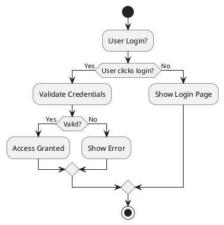
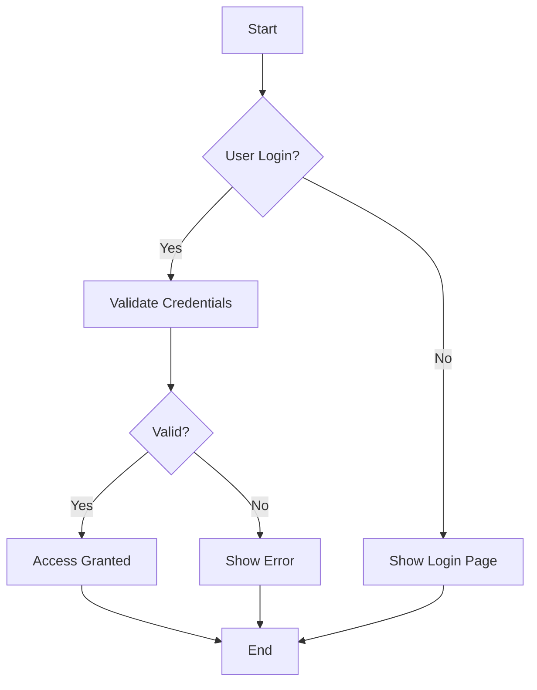

# Render Test in GitHub

text-based diagrams rendering test in GitHub.

## PlantUML

```plantuml
@startuml
start
:User Login?;
if (User clicks login?) then (Yes)
    :Validate Credentials;
    if (Valid?) then (Yes)
        :Access Granted;
    else (No)
        :Show Error;
    endif
else (No)
    :Show Login Page;
endif
stop
@enduml

```

## MermaidJS

```mermaid
flowchart TD
    A[Start] --> B{User Login?}
    B -- Yes --> C[Validate Credentials]
    C --> D{Valid?}
    D -- Yes --> E[Access Granted]
    D -- No --> F[Show Error]
    B -- No --> G[Show Login Page]
    E --> H[End]
    F --> H
    G --> H

```

